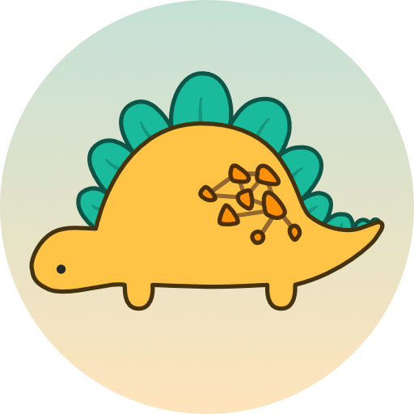

<p align="center">
  
</p>

petgraph
===
Petgraph provides fast, flexible graph data structures and algorithms
in Rust. Supporting both directed and undirected graphs with arbitrary
node and edge data. It comes with:

* **Multiple Graph Types**: Graph, StableGraph, GraphMap, and
  MatrixGraph to suit various use cases.

* **Algorithms Included & Extensible**: For tasks like path-finding,
  minimum spanning trees, graph isomorphisms, and more - with traits
  exposed for implementing custom algorithms.

* **Graph Visualization support**: Export/import graphs
  to/from [DOT][dot-url] format for visualization with
  [Graphviz][graphviz-url].

Supports Rust 1.64 and later. This will only change on major releases.

[![Crates.io][crates-badge]][crates-url]
[![docs.rs][docsrs-badge]][docsrs]
![MSRV][msrv-badge]
[![Discord chat][discord-badge]][discord-url]
[![Build Status][build-status]][ci-url]

## Example

For more examples, see
the [documentation on docs.rs][docsrs-examples].

```rust
use petgraph::graph::UnGraph;
use petgraph::algo::{dijkstra, min_spanning_tree};
use petgraph::data::FromElements;
use petgraph::dot::{Dot, Config};
use petgraph::visit::NodeIndexable;

fn main() {
    // Create an undirected graph with associated data
    // of type `i32` for the nodes and `()` for the edges.
    let g = UnGraph::<i32, ()>::from_edges(&[
        (0, 1), (1, 2), (2, 3), (0, 3)
    ]);

    // The graph looks like this:
    // 0 -- 1
    // |    |
    // 3 -- 2

    // Find the shortest path from `0` to `2` using `1` as the cost for every edge.
    let node_map = dijkstra(&g, 0.into(), Some(2.into()), |_| 1);
    assert_eq!(&2i32, node_map.get(&g.from_index(2)).unwrap());

    // Get the minimum spanning tree of the graph as a new graph, and check that
    // one edge was trimmed.
    let mst = UnGraph::<_, _>::from_elements(min_spanning_tree(&g));
    assert_eq!(g.raw_edges().len() - 1, mst.raw_edges().len());

    // Output the tree to `graphviz` `DOT` format
    println!("{:?}", Dot::with_config(&mst, &[Config::EdgeNoLabel]));
    // graph {
    //     0 [ label = "0" ]
    //     1 [ label = "0" ]
    //     2 [ label = "0" ]
    //     3 [ label = "0" ]
    //     0 -- 1 [ ]
    //     2 -- 3 [ ]
    //     1 -- 2 [ ]
    // }
}
```

## Documentation

* [API documentation on docs.rs][docsrs]
* [Examples on docs.rs][docsrs-examples]
* [Changelog][changelog]

### Crate features

petgraph is built with these features enabled by default:

- `graphmap` - Enables [`GraphMap`][docsrs-graph-map].
- `stable_graph` - Enables [`StableGraph`][docsrs-stable-graph].
- `matrix_graph` - Enables [`MatrixGraph`][docsrs-matrix-graph].
- `std` - Enables the Rust Standard Library.
  Disabling the `std` feature makes it possible to use `petgraph`
  in `no_std` contexts.

Optionally, the following features can be enabled:

- `serde-1` - Enables serialization for
  `Graph, StableGraph, GraphMap`
  using [serde 1.0][docsrs-serde]. Requires Rust version as required
  by serde.
- `rayon` - Enables parallel iterators for the underlying data
  in `GraphMap`. Requires Rust version as required
  by [rayon][docsrs-rayon].
- `dot_parser` - Enables parsing graph
  from [DOT/Graphviz][dot-url]
  strings and files.
- `generate` - Enables graph generators.
- `unstable` - Enables unstable crate features (currently only
  `generate`). The API of functionality behind this flag is subject to
  change at any time.

## Getting Help

First, see if the answer to your question can be found in the
[API documentation][docsrs]. If the answer is not there, feel free
to ask your question on the [discussions page][github-discussions].
We would be happy to try to answer your question. If you find a bug,
or have a feature request, please [open an issue][github-new-issue].

## Contributing

🦕 Thanks for your help improving the project! We are so happy to have
you! We have a [contributing guide][contributing] to help you get
started.

## Logo

The mascot is named "Sir Paul Rustory Graphosaurus" (close friends
call him Paul).
The logo has been created by the talented Aren.

## License

Dual-licensed to be compatible with the Rust project.

Licensed under the [Apache License, Version 2.0][apache-license] or
the [MIT license][mit-license], at your option. This file may
not be copied, modified, or distributed except according to those
terms.

[apache-license]: http://www.apache.org/licenses/LICENSE-2.0

[build-status]: https://github.com/petgraph/petgraph/actions/workflows/ci.yml/badge.svg

[changelog]: CHANGELOG.md

[ci-url]: https://github.com/petgraph/petgraph/actions/workflows/ci.yml

[contributing]: CONTRIBUTING.md

[crates-badge]: https://img.shields.io/crates/v/petgraph.svg

[crates-url]: https://crates.io/crates/petgraph

[discord-badge]:  https://img.shields.io/discord/1166289348384280616?logo=discord&style=flat

[discord-url]: https://discord.gg/n2tc79tJ4e

[docsrs]: https://docs.rs/petgraph/latest/petgraph/

[docsrs-badge]: https://img.shields.io/docsrs/petgraph

[docsrs-examples]: https://docs.rs/petgraph/latest/petgraph/index.html#examples

[docsrs-graph-map]: https://docs.rs/petgraph/latest/petgraph/graphmap/struct.GraphMap.html

[docsrs-matrix-graph]: https://docs.rs/petgraph/latest/petgraph/matrix_graph/struct.MatrixGraph.html

[docsrs-rayon]: https://docs.rs/rayon/latest/rayon/

[docsrs-serde]: https://docs.rs/serde/latest/serde/index.html

[docsrs-stable-graph]: https://docs.rs/petgraph/latest/petgraph/stable_graph/struct.StableGraph.html

[dot-url]: https://www.graphviz.org/doc/info/lang.html

[github-discussions]: https://github.com/petgraph/petgraph/discussions

[github-new-issue]: https://github.com/petgraph/petgraph/issues/new

[graphviz-url]: https://www.graphviz.org/

[mit-license]: http://opensource.org/licenses/MIT

[msrv-badge]: https://img.shields.io/badge/rustc-1.64+-blue.svg