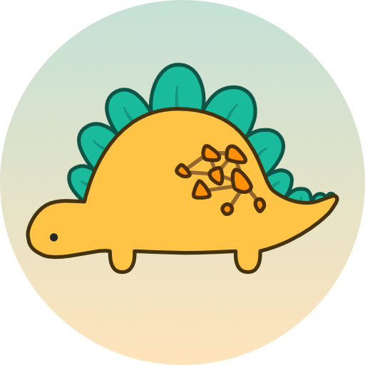

# petgraph

Graph data structure library. Please read the [API documentation here][].

Supports Rust 1.64 and later.

[![Crates.io][crates-badge]][crates-url]
[![docs.rs][docsrs-badge]][docsrs-url]
![MSRV][msrv-badge]
[![Discord chat][discord-badge]][discord-url]
[![build_status][]](https://github.com/petgraph/petgraph/actions)

Crate feature flags:

-   `graphmap` (default) enable `GraphMap`.
-   `stable_graph` (default) enable `StableGraph`.
-   `matrix_graph` (default) enable `MatrixGraph`.
-   `serde-1` (optional) enable serialization for `Graph, StableGraph, GraphMap`
    using serde 1.0. Requires Rust version as required by serde.
-   `rayon` (optional) enable parallel iterators for the underlying data in `GraphMap`. Requires Rust version as required by Rayon.

## Recent Changes

See [RELEASES][] for a list of changes. The minimum supported rust
version will only change on major releases.

## Logo

The mascot is named "Sir Paul Rustory Graphosaurus" (close friends call him Paul).
The logo has been created by the talented Aren.

## License

Dual-licensed to be compatible with the Rust project.

Licensed under the Apache License, Version 2.0
<http://www.apache.org/licenses/LICENSE-2.0> or the MIT license
<http://opensource.org/licenses/MIT>, at your option. This file may not
be copied, modified, or distributed except according to those terms.

[API documentation here]: https://docs.rs/petgraph/
[build_status]: https://github.com/petgraph/petgraph/workflows/Continuous%20integration/badge.svg?branch=master
[docsrs-badge]: https://img.shields.io/docsrs/petgraph
[docsrs-url]: https://docs.rs/petgraph/latest/petgraph/
[crates-badge]: https://img.shields.io/crates/v/petgraph.svg
[crates-url]: https://crates.io/crates/petgraph
[discord-badge]:  https://img.shields.io/discord/1166289348384280616?logo=discord&style=flat
[discord-url]: https://discord.gg/n2tc79tJ4e
[msrv-badge]: https://img.shields.io/badge/rustc-1.64+-blue.svg
[RELEASES]: RELEASES.rst
