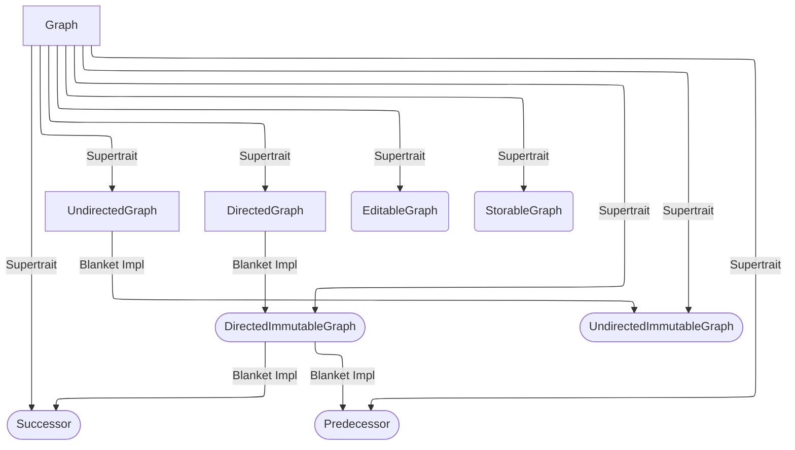

# Graph Traits

The main traits and their relationships are shown in the following mermaid diagram. Note that `Graph` is a supertrait of all other traits as indicted by the labelled arrow. The rest of this document contains an explanation of the individual traits and their motivation.

The shapes of the boxes are supposed to indicate the importance of a given trait.

- **Rectangles**:  are the most fundamental traits where `DirectedGraph` and `UndirectedGraph` are counterparts of one another.
- **Rectangles with rounded edges**: are additional traits which are necessary for most algorithms in petgraph.
- **Rounded boxes**: are additional traits which are usually implemented automatically with a blanket implementation.

## `Graph`

The [`Graph`](../../crates/core/src/graph/mod.rs) trait lays the foundation for all the other traits. It contains associated types for the identifiers for nodes and edges as well as the types for node and edge data as well as the different reference types.

In other words, it contains the basic types and building blocks for a given graph and is strictly necessary to use any of the functionality of the `petgraph` crate.

## `DirectedGraph` and `UndirectedGraph`

These traits contain essential graph methods. That is, the contain methods for interacting with vertices and edges in the graph via iteration or mutating associated data. In particular, these graphs contain no methods to add or remove nodes or edges. That is, they don't change the topology of the graph.

Either of them but never both should be implemented for a graph type to offer as much functionality as possible. If the associated data of nodes and edges is not supposed to be mutable, the `Immutable` counterpart traits exist.

## `StorableGraph`

