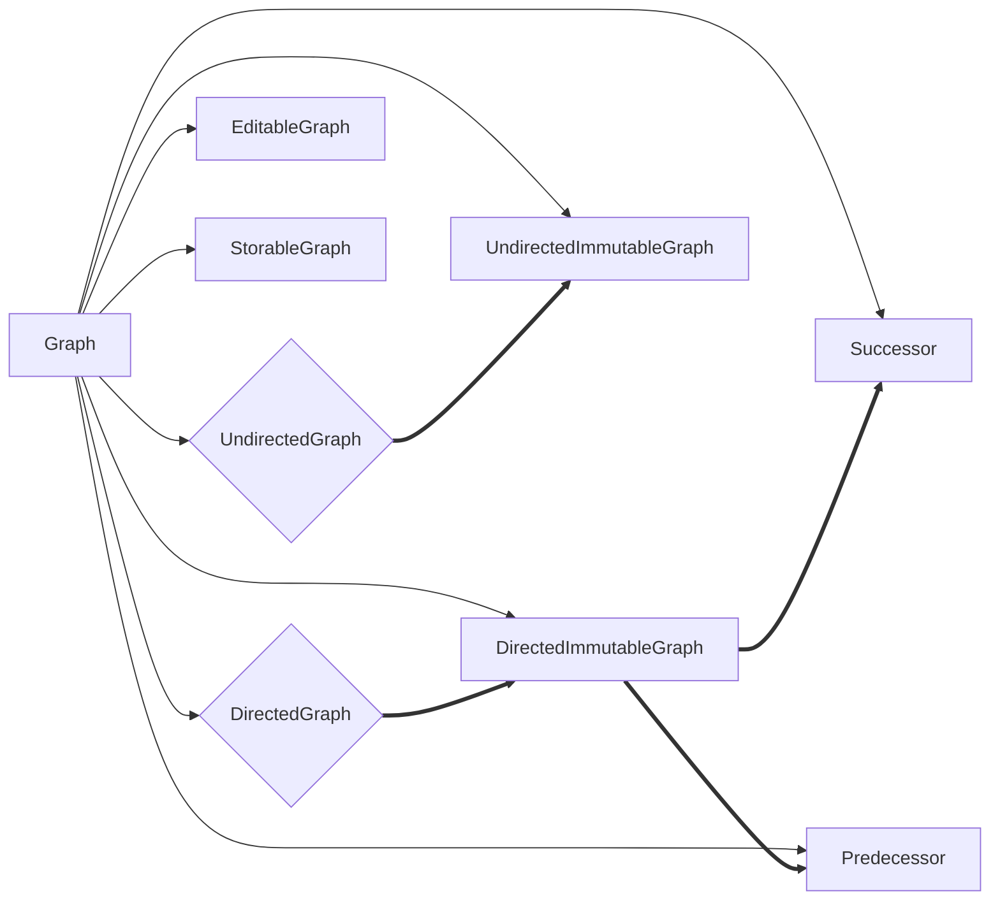

```mermaid
graph LR
    G[Graph] --> U{UndirectedGraph}
    G[Graph] --> D{DirectedGraph}
    G --> DI[DirectedImmutableGraph]
    G --> UI[UndirectedImmutableGraph]
    G --> E[EditableGraph]
    G --> S[StorableGraph]
    G --> SU[Successor]
    G --> P[Predecessor]
    D ==> DI
    U ==> UI
    DI ==> SU
    DI ==> P
```